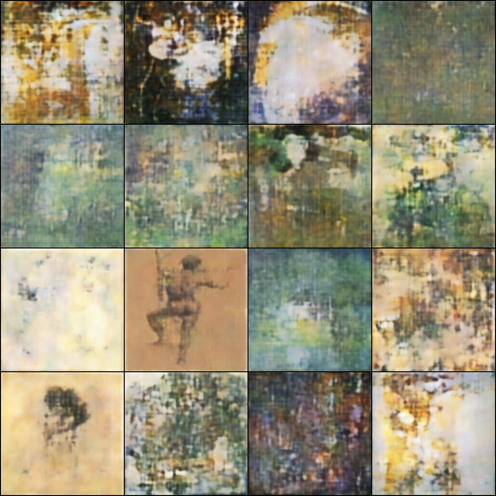

# phantasie_klimt

This is a short experiment oon using generative models for image synthesis. As the name suggests, generative models have the capacity to generate samples. So I thought it would be a cool experiment to attempt to train one of such models to generate pictures that resemble the art of a given artist.

For the generative model, I went with a convolutional variational autoencoder. As for the data, I used a publicly available dataset on Kaggle which includes images of artworks from dozens of famous artists. More specifically, I used images of Gustav Klimt's work. For several reasons:

* Gustav Klimt's work is fairly diverse both in its style and its colour, which renders the learning process a challenging ordeal;
* I've actualy had the pleasure of seeing some of Klimt's work in the Belvedere Museum in Austria and it remains one of my favourite memories.

The model was trained for 1500 epochs, which seems like a lot, but the dataset was comprised of only 117 images. Nonetheless, this took almost a full day to train, because I'm training all my models on CPU since I do not own a Nvidia GPU. I will probably revisit this experiment when I acquire one.

## Final sampling result

### Revelant Links

[Variational Autoencoder Paper](https://arxiv.org/abs/1312.6114)

[Kaggle Dataset Link](https://www.kaggle.com/ikarus777/best-artworks-of-all-time)
